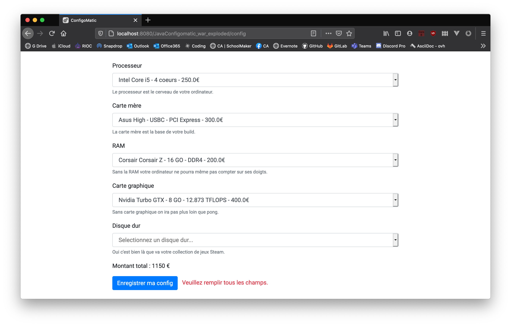
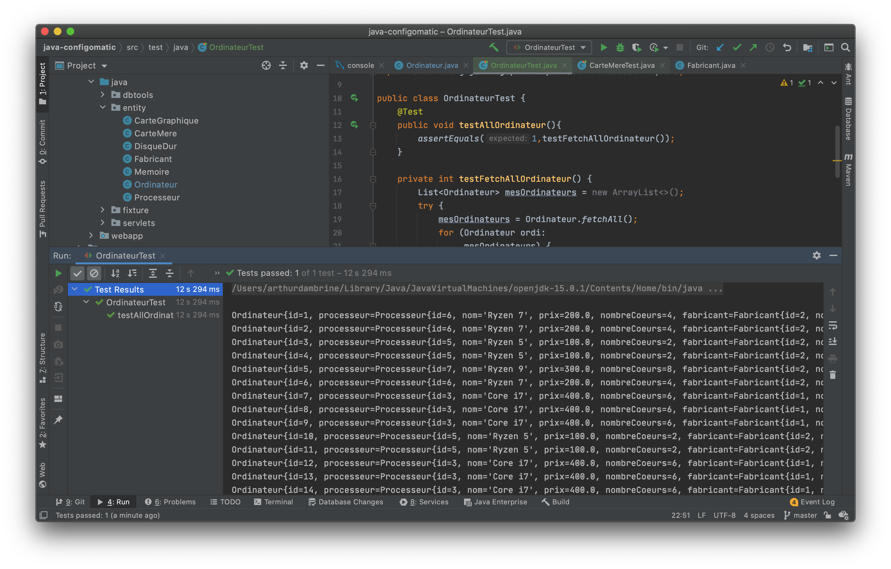
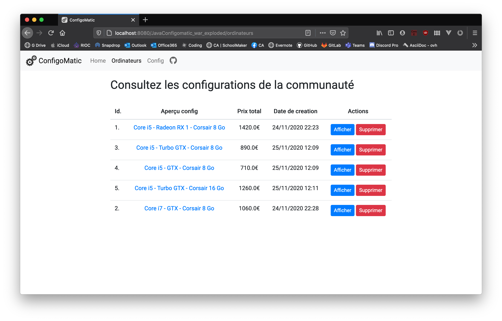
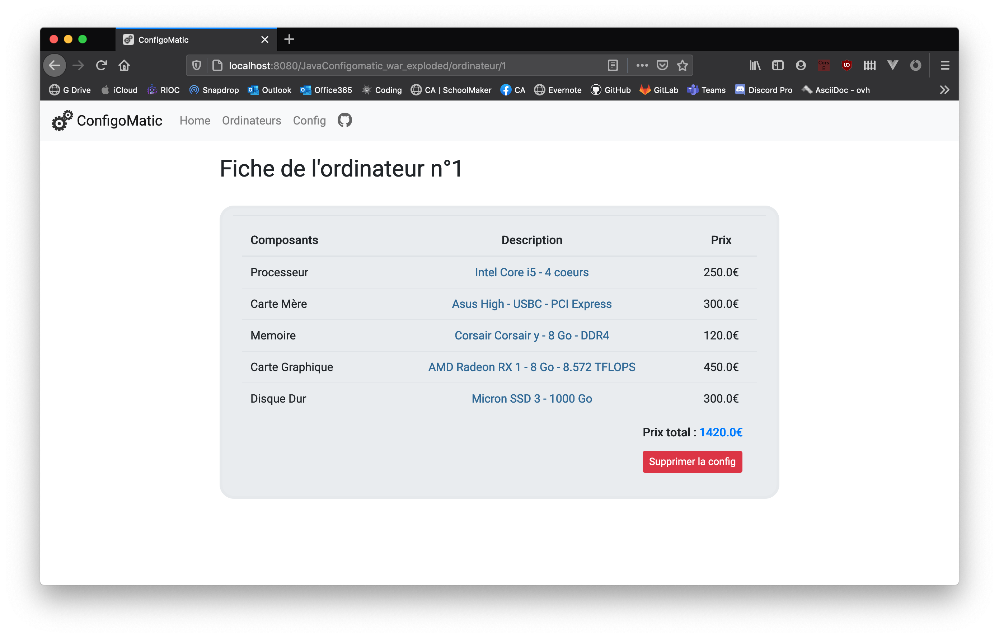

# Projet Java EE - Configomatic

## Introduction - sujet
Le sujet est libre, la seule contrainte est de créer une application basée entièrement sur la technologie Java EE (Backend et Frontend doivent être développés dans une seule application) cette application doit interagir permettre l’interaction avec l’utilisateur sous forme d’une application web et permettre la mise à jour des informations sur une base de données. Nous privilégierons pour ce projet une approche MVC.

Nous allons séparer :
- le code de gestion de nos entités d’une une part (**model**)
- les servlets (**controler**)
- les pages JSP (**view**)

Nous avons fait le choix de créer une application de montage de PC de bureau custom (entendez par là une config gaming !).

## Première séance (20-11-2020)

- Mise en place de la base de donnée
- Création de fixtures (pour remplir la base de données avec les composants et fabricants)
- Mise en place des premiers objets de manipulation de ces données

Schéma de notre base de donnée :

Bonus : rédaction des tests unitaires (test de lecture des composants et fabricants)

## Deuxième séance (24-11-2020)

- Mise en place des deux servelets de base (/ordinateurs, /config)
- Design minimal de la webapp
- Création du formulaire config

- Enrichissement du formulaire config avec les composants enregistrés en base
- Calcul du montant total des composants en euros via une fonction JavaScript (calculmontant.js)
- Création d'une requête ajax d'envoi du formulaire (format application/json)
- Création d'un servlet dédiée à la création d'ordinateur (/postordinateur)

Note : pour le moment on retourne le contenu du json tel quel

- Validation de la requête ajax par le serveur

- Creation de la methode Ordinateur.createOne

- Insertion d'un ordinateur en base après la requête post en ajax

- Affichage des erreur de la requête ajax si il y en a sinon on retourne '201 created'

  

- Exemples d'erreurs affichées à l'utilisateur :

  1. Si l'utilisateur n'a pas remplit tous les champs

  
  
  2. Si une erreur survient côté serveur on retourne un code 500 
     + json {"message":"Une erreur est survenue dans la requête"}
  
  

## Troisième séance (27-11-2020)

- Création de la methode Ordinateur.fetchAll (problème des requêtes imbriquées, résolu en faisant une grande requête SQL ( 12s d'excution (avec augmentation linéaire du temps de d'excution xordinateurs*5 requêtes ) avec 32 entitées vs 1s avec 32 entitées))

  

Capture : Résultat du test avec requêtes imbriquées successives (32 etitées ordinateur = 12s)

- Création de la requête SQL d'un seul bloc pour ordinateurs avec composants et fabricants imbriqués

- Création de la vue liste des ordinateurs (/ordinateurs) et fiche individuelle ordinateur (/ordinateur/{id})

- Création de la methode Ordinateur.deleteOne, et de la servlet (DeleteOrdinateur avec /deleteordinateur/{id})

- Ajout des boutons de suppression d'un ordinateur dans la liste des ordinateurs et la fiche individuelle ordinateur

  

1. Liste des ordinateurs

2. Fiche d'un ordinateur