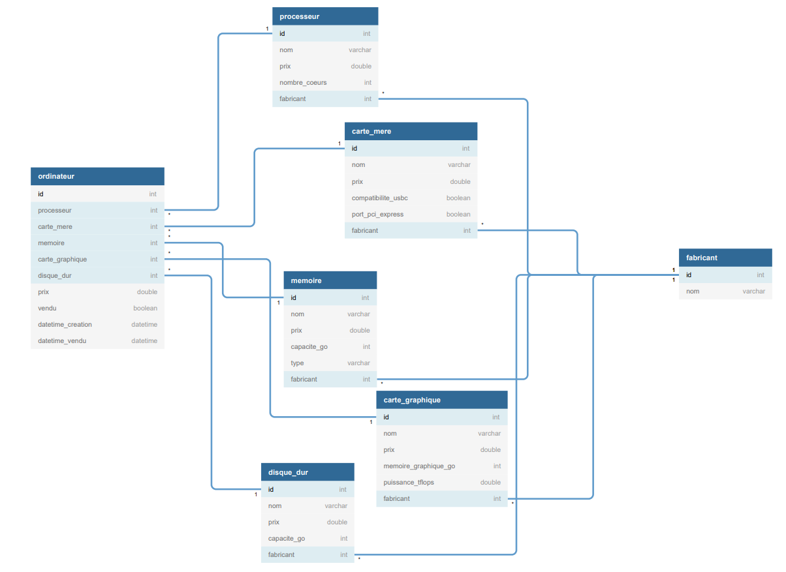
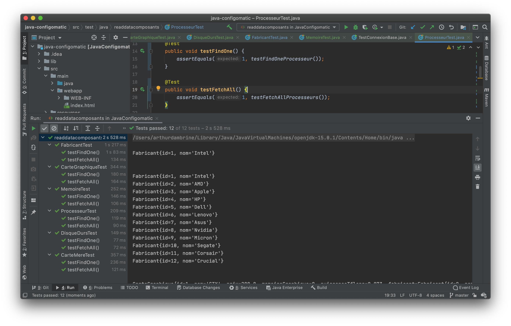

# Projet Java EE - Configomatic

## Introduction - sujet
Le sujet est libre, la seule contrainte est de créer une application basée entièrement sur la technologie Java EE (Backend et Frontend doivent être développés dans une seule application) cette application doit interagir permettre l’interaction avec l’utilisateur sous forme d’une application web et permettre la mise à jour des informations sur une base de données. Nous privilégierons pour ce projet une approche MVC.

Nous allons séparer :
- le code de gestion de nos entités d’une une part (**model**)
- les servlets (**controler**)
- les pages JSP (**view**)

Nous avons fait le choix de créer une application de montage de PC de bureau custom (entendez par là une config gaming !).

## Première séance (20-11-2020)

- Mise en place de la base de donnée
- Création de fixtures (pour remplir la base de données avec les composants et fabricants)
- Mise en place des premiers objets de manipulation de ces données

Schéma de notre base de donnée :

Bonus : rédaction des tests unitaires (test de lecture des composants et fabricants)

